<!-- README.md is generated from README.Rmd. Please edit that file -->

# nationalparkcolors

The goal of nationalparkcolors is to provide an interface to the
beautiful colors in National Park posters and images. The posters are a
mix of the WPA originals and more modern remakes.

## Installation

You can install the released version of nationalparkcolors from GitHub
with:

``` r
# install.packages("devtools")
devtools::install_github("katiejolly/nationalparkcolors")
```


## Example

There are 25 total palettes to choose from.

``` r
library(nationalparkcolors)

names(park_palettes)
#>  [1] "SmokyMountains" "RockyMountains" "Yellowstone"    "Arches"        
#>  [5] "ArcticGates"    "MtMckinley"     "GeneralGrant"   "Hawaii"        
#>  [9] "CraterLake"     "Saguaro"        "GrandTeton"     "BryceCanyon"   
#> [13] "MtRainier"      "Badlands"       "Redwoods"       "Everglades"    
#> [17] "Voyageurs"      "BlueRidgePkwy"  "Denali"         "GreatBasin"    
#> [21] "ChannelIslands" "Yosemite"       "Acadia"         "DeathValley"   
#> [25] "Zion"
```

You can create a palette in just one command (+ get an image of the
palette).

``` r
pal <- park_palette("MtRainier")
```

If you want a specific number of colors, you can also do
that.

``` r
pal <- park_palette("MtRainier", 4)
```

## Palettes

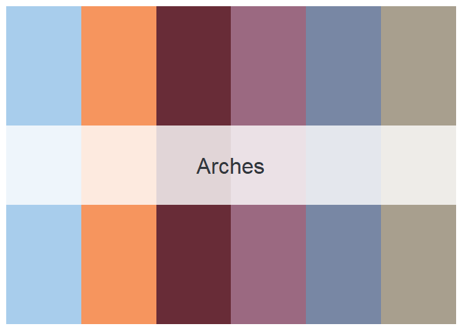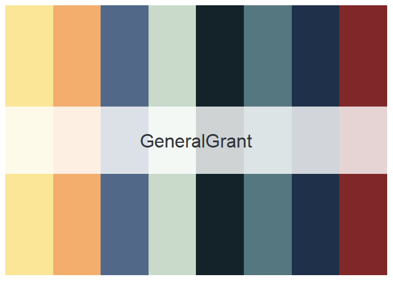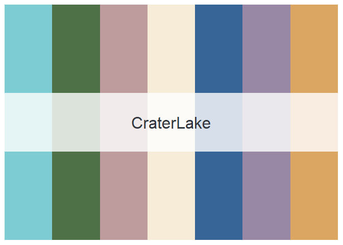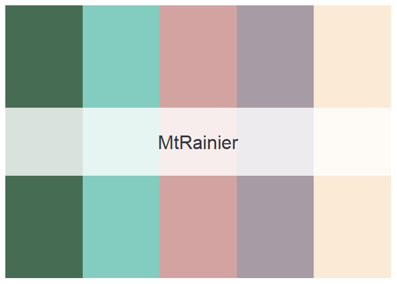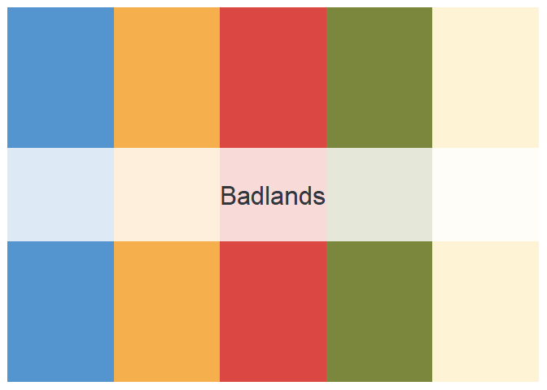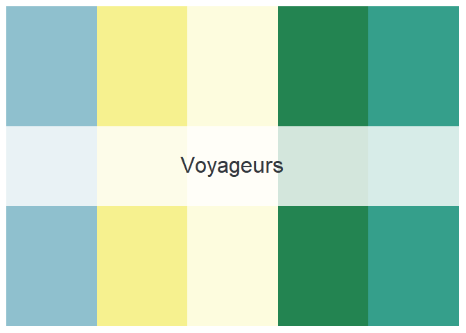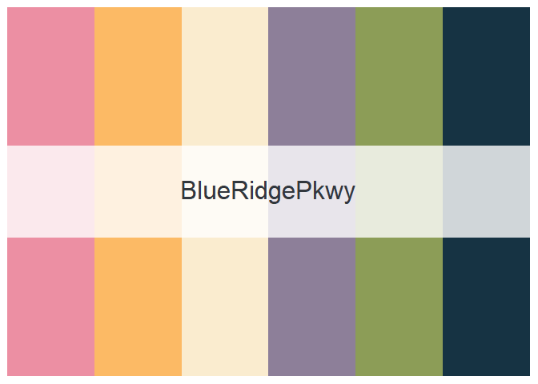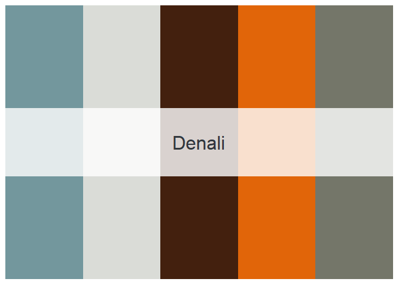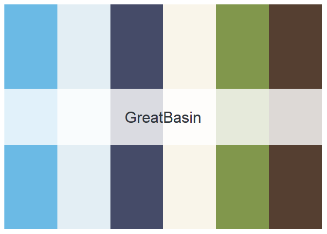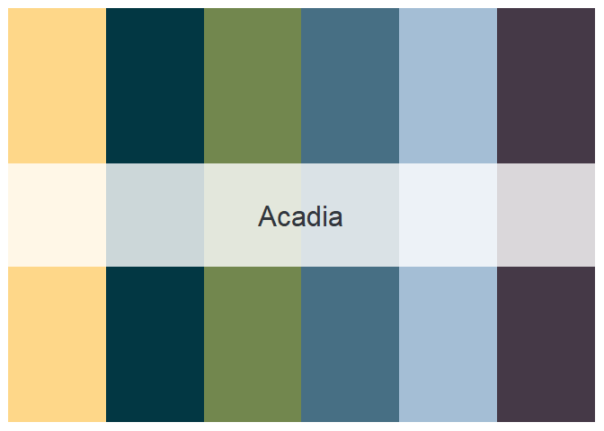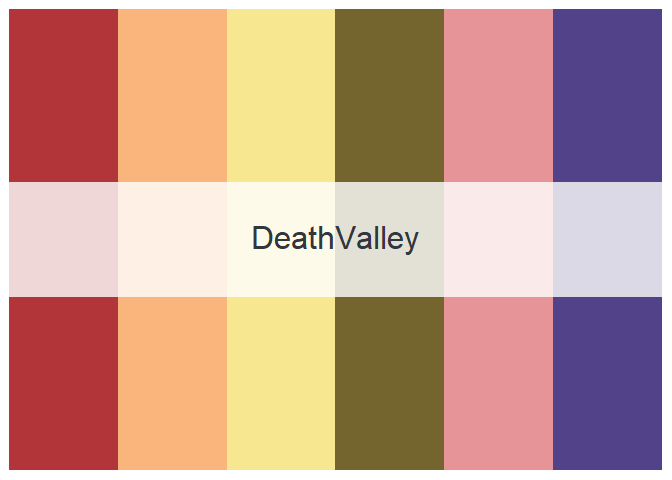

Along with the nice color palettes, I also hope that people think more
about the national park system when using this package. I am not
affiliated with the Park Service, but if you’d like to support them you
can [donate here](https://www.nps.gov/getinvolved/donate.htm).
